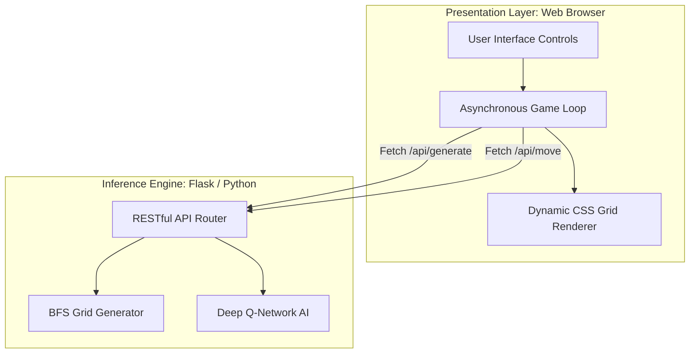
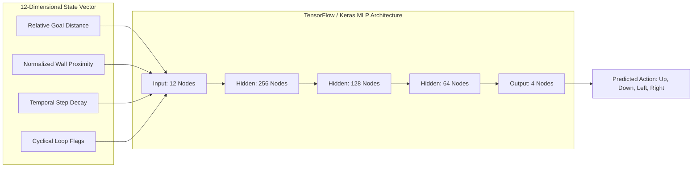
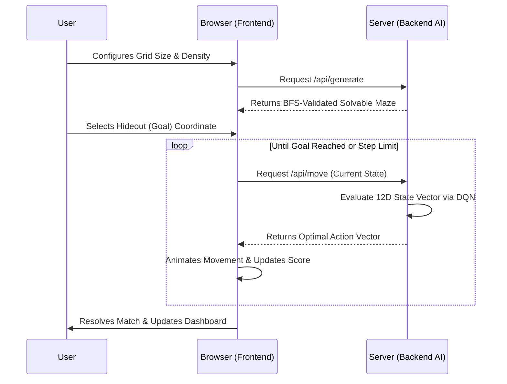

# Beat Agent Putin: Deep Reinforcement Learning Maze Simulator

Beat Agent Putin is a high-fidelity, decoupled web application that serves as an interactive testing ground for autonomous navigation. It pits human strategic placement against a Deep Q-Network (DQN) artificial intelligence within a mathematically guaranteed, dynamically generated grid-world topology.

## Architectural Overview

The project is structured around a strict client-server decoupling, ensuring that heavy tensor computations remain entirely isolated from the browser's render thread.



### 1. The Inference Engine (Backend API)
- **Stochastic Environment Generation:** The engine dynamically constructs 2D grids parameterized by user-defined wall probabilities. It employs a Breadth-First Search (BFS) graph-traversal algorithm that validates topological solvability before transmitting the environment to the client.
- **Deep Q-Network AI:** The core intelligence is a Multi-Layer Perceptron (MLP) built with TensorFlow/Keras, trained via Q-learning to maximize a sophisticated reward structure (penalizing walls/out-of-bounds, rewarding goal acquisition).



### 2. The Presentation Layer (Frontend)
- **Dynamic CSS Grid Rendering:** The frontend relies on responsive fractional `minmax(0, 1fr)` layouts to guarantee that aspect ratios remain perfectly rigid regardless of grid complexity.
- **Thematic Aesthetics:** The dashboard employs a professional constructivist design utilizing a sharp red, white, and blue palette to reflect the thematic "KGB Evasion" narrative.

## Tournament Workflow



## Technology Stack

**Frontend (Presentation Layer)**
- **HTML5:** Semantic markup structure.
- **CSS3:** Custom styling, CSS Grid, and responsive flexbox layouts (No CSS frameworks).
- **Vanilla JavaScript (ES6+):** Asynchronous API fetching, DOM manipulation, and state management (No JS frameworks).

**Backend (Inference Engine)**
- **Python (3.8+):** Core backend logic.
- **Flask:** Lightweight WSGI web application framework for routing and API endpoints.
- **NumPy:** High-performance matrix operations for grid generation and state array manipulation.

**Artificial Intelligence**
- **TensorFlow / Keras:** Deep learning library used to construct and train the Deep Q-Network.
- **Q-Learning Algorithm:** Reinforcement learning technique utilized to discover optimal navigation policies.

## Local Installation and Execution

### Deployment Instructions

1. **Clone the Repository:** Pull the codebase to your local environment.
2. **Initialize a Virtual Environment:** Isolate your dependencies to prevent global package conflicts.
   ```bash
   python -m venv venv
   source venv/bin/activate  # Windows: venv\Scripts\activate
   ```
3. **Install Tensor and Web Dependencies:**
   ```bash
   pip install -r requirements.txt
   ```
4. **Ignite the Server:** Start the Flask inference engine.
   ```bash
   python app.py
   ```

## User Guide

Navigate to `http://localhost:5000` to access the dashboard. 

The objective is strategic placement. Using the control panel on the right, define the grid boundaries, algorithmic speed, and obstacle density. When the round begins, your goal is to select a "Hideout" coordinate that maximizes topological complexity. Try to find the blind spots in the agent's multi-dimensional training space—force it into dead ends, bait it into temporal loops, and outlast its step limit to win the tournament.
